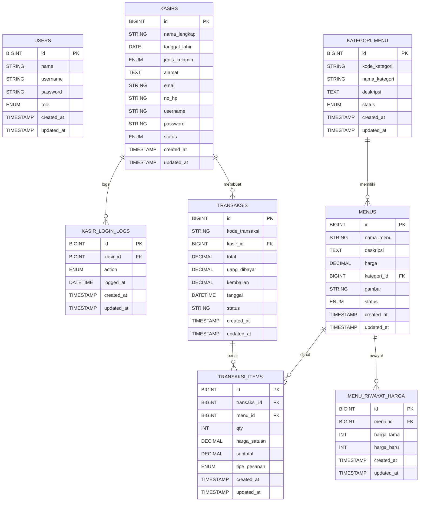

# Sistem Manajemen Kasir & Menu

>Aplikasi kasir berbasis Laravel dengan peran Admin, Owner, dan Kasir. Fokus utama: manajemen menu, transaksi kasir, laporan, serta manajemen data master.

## Ringkasan Alur Sistem

1. **Pengguna membuka aplikasi**
	- Halaman awal menampilkan daftar menu aktif.
2. **Login sesuai peran**
	- Admin/Owner/Kasir login melalui halaman login.
3. **Akses dashboard per peran**
	- Admin: dashboard admin + manajemen data master.
	- Owner: dashboard owner + monitoring & laporan.
	- Kasir: dashboard kasir + transaksi harian.
4. **Kelola data sesuai peran**
	- Admin: kategori_menu, menu, kasir, laporan kasir.
	- Owner: kasir, menu, laporan kasir, daftar transaksi.
	- Kasir: transaksi, item transaksi, profil.
5. **Proses transaksi kasir**
	- Kasir memilih menu → sistem hitung total → pembayaran → transaksi & item tersimpan.

## Skema Database (ERD)

> Catatan: tabel **kategori_produk** diganti menjadi **kategori_menu**.

### Catatan Penghapusan Tabel

Tabel berikut dihapus dari skema dokumentasi:
`produk`, `suppliers`, `purchase_orders`, `riwayat_harga`, `mutasi_stoks`, `ulasan`, `detail_pesanan`, `pesanan`, `penerimaa_barang`, `kendaraan`, `pelanggan`, `pembayaran`.

## Peran & Hak Akses

- **Admin**
  - Kelola kategori_menu, menu, kasir.
  - Lihat dan ekspor laporan kasir.

- **Owner**
  - Lihat ringkasan dashboard owner.
  - Kelola kasir (lihat/edit).
  - Lihat menu dan riwayat harga menu.
  - Lihat dan ekspor laporan kasir.

- **Kasir**
  - Dashboard kasir (omset, transaksi hari ini, dsb.).
  - Proses transaksi dan checkout.
  - Lihat transaksi & item transaksi.
  - Update profil kasir.

## Modul Utama

- **Autentikasi**: login, logout, register (admin/kasir/owner).
- **Master Data**: kategori_menu, kasir.
- **Menu**: CRUD menu + riwayat harga menu.
- **Transaksi**: kasir checkout, daftar transaksi, item transaksi.
- **Laporan**: laporan kasir + ekspor.

## Rute Penting (Ringkas)

- **Umum**
  - `/` (landing menu aktif)
  - `/login`, `/logout`, `/register`

- **Admin (auth + role:admin)**
  - `/dashboard`
  - `/kategori`, `/kasir`, `/menu`
  - `/laporan/kasir`

- **Owner (auth + role:owner)**
  - `/dashboardowner`
  - `/owner/kasir/*`
  - `/owner/menu`
  - `/owner/laporan/kasir`

- **Kasir (auth:kasir + role:kasir)**
  - `/dashboardkasir`
  - `/transaksi`, `/transaksi/checkout`
  - `/kasir-profile`

## Teknologi

- Laravel
- Tailwind CSS
- MySQL/MariaDB

## Cara Menjalankan (Lokal)

1. Install dependensi:
	- `composer install`
	- `npm install`
2. Copy env:
	- `cp .env.example .env`
3. Generate key:
	- `php artisan key:generate`
4. Konfigurasi database di `.env`
5. Migrasi & seeder:
	- `php artisan migrate --seed`
6. Build asset:
	- `npm run build` (atau `npm run dev`)
7. Jalankan server:
	- `php artisan serve`

## Dokumen Pendukung

- ARCHITECTURE_OVERVIEW.md
- MENU_SYSTEM_DOCS.md
- COMPLETION_REPORT.md
- DEPLOYMENT_SUMMARY.md
